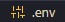

# Introdução
Este é um guia para  projeto BookGuardian. Ele inclui instruções sobre como configurar um ambiente virtual, instalar pacotes necessários e executar o projeto.

Demo: https://book-guardian-production.up.railway.app/


## Recomendado:
`PYTHON >= 3.11`
`Django == 5`

## Como Executar
Para executar o projeto, siga as etapas abaixo:

### 1. Criação de Ambiente Virtual
Para isolar as dependências do projeto, é recomendável criar um ambiente virtual. Utilize o seguinte comando:

```bash
# No diretório do seu projeto
python -m venv venv
```

### 2. Ativação do Ambiente Virtual
#### Windows
```bash
venv\Scripts\activate
```

#### Linux
```bash
source venv/bin/activate
```

### 3. Instalação de Pacotes
Com o ambiente virtual ativado, instale os pacotes necessários usando o `pip`:

```bash
pip install -r requirements.txt
```

Certifique-se de ter um arquivo `requirements.txt` com as dependências do seu projeto.


### 4. Remova o "-example do arquivo .env"

Para configurar corretamente o arquivo `.env`, remova o sufixo `-example` do nome do arquivo.

Exemplo:


Deixa assim:




### 5.  Configuração do Banco de Dados

Este projeto carrega dados do banco de dados utilizando o gerenciador Python `makemigrations` e `migrate`.

Antes de começar, certifique-se de ter configurado corretamente o banco de dados. Para isso, execute os seguintes comandos:

```bash
python manage.py makemigrations
python manage.py migrate
```

### 6. Execução do Projeto
Após instalar as dependências, você pode rodar o projeto:

```bash
python manage.py runserver
```

O servidor de desenvolvimento será iniciado e você poderá acessar o projeto em `http://localhost:8000/`.


# Configuração extra OPCIONAL `.env`:

### DEBUG

Enquanto estiver programando deixe o debug em True, recomendado deixa False quando for fazer o deploy da aplicação

```bash
DEBUGDB='True'
```

### API-Gmail
Api do gmail para poder habilitar login via google

Cria sua api [aqui](https://console.cloud.google.com/project).
`https://console.cloud.google.com/project`
```bash
CLIENT_ID="COLOQUE AQUI SUA CLIENT-ID DO API DO GMAIL"
SECRET="COLOQUE AQUI A SECRECT-KEY DO GMAIL"
```

### Enviar-Email

Habilita Configuração para poder enviar email pro usuario

```bash
EMAIL_HOST = 'SEU PROVEDOR EMAIL'
EMAIL_POST = 'USA PORTA'
EMAIL_USE_TLS = True
EMAIL_HOST_USER ='SEU EMAIL APP'
EMAIL_HOST_PASSWORD ='SUA SENHA APP EMAIL'
```
### Usa-database-Postgres

Se deseja altera o banco de dados adicione essa configuração
#### Postgres

```bash
DATABASE_ENGINE = 'django.db.backends.postgresql'
PGDATABASE = "NOME SUA DATABSE"
PGUSER = "NOME DE USER"
PGPASSWORD = "SENHA DO DB"
PGHOST = "HOST-DB"
PGPORT = "PORT-DB"
```

#### Config-MEDIA_ROOT:
padrao: "media"
```bash
RAILWAY_VOLUME_MOUNT_PATH = "media"
```


